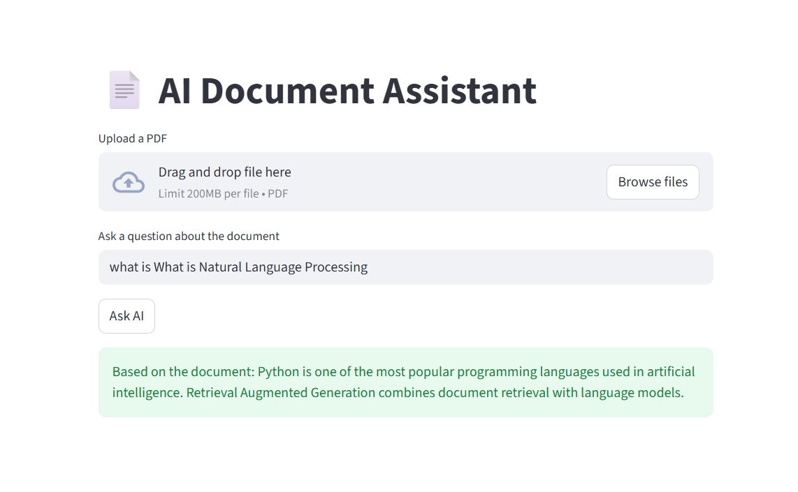
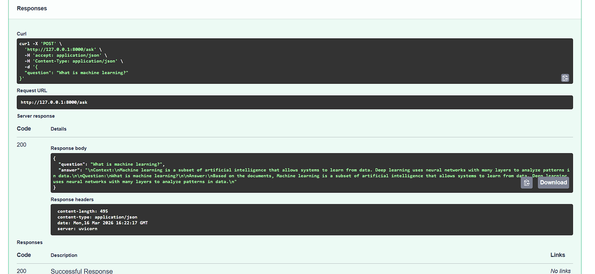

# 🤖 AI Document Assistant (RAG using Endee)

An AI-powered document assistant that allows users to upload PDFs and ask questions about the document.  
The system uses Retrieval-Augmented Generation (RAG) with the Endee vector database to retrieve relevant content and generate answers.

---

## 🚀 Features

- 📄 Upload PDF documents
- 🔍 Semantic search using embeddings
- 🧠 Retrieval-Augmented Generation (RAG)
- ⚡ Fast API backend
- 💬 Interactive chat interface
- 🗄 Vector storage using Endee

---

## 🛠 Tech Stack

- Python
- FastAPI
- Streamlit
- Sentence Transformers
- Endee Vector Database

---

## 🏗 System Architecture

```
User Question
     ↓
Streamlit Chat UI
     ↓
FastAPI Backend
     ↓
Embedding Model
     ↓
Endee Vector Database
     ↓
Retrieve Relevant Documents
     ↓
Generate AI Answer
```

---

## 📸 Project Screenshots

### Chat Interface



### API Documentation



---

## 📂 Project Structure

```
endee-rag-ai-project
│
├── app.py              # FastAPI backend
├── chat_ui.py          # Streamlit chat interface
├── embeddings.py       # Document embedding generation
├── search.py           # Semantic search logic
├── rag_pipeline.py     # RAG pipeline
├── endee_db.py         # Endee vector DB connection
│
├── data
│   └── documents.txt   # Knowledge base
│
├── images              # Screenshots for README
│
├── requirements.txt
└── README.md
```

---

## ⚙ Installation

Clone the repository:

```
git clone https://github.com/YOUR_USERNAME/endee-rag-ai-project.git
cd endee-rag-ai-project
```

Install dependencies:

```
pip install -r requirements.txt
```

---

## ▶ Running the Project

Generate embeddings:

```
python embeddings.py
```

Start API server:

```
python -m uvicorn app:app --reload
```

Start chat interface:

```
python -m streamlit run chat_ui.py
```

Open browser:

```
http://localhost:8501
```

---

## 💡 Example Questions

You can ask questions like:

- What is machine learning?
- What is artificial intelligence?
- What does the document explain?
- What are applications of AI?

---

## 📌 Use Case

This project demonstrates how vector databases like **Endee** can be used to build AI-powered search and question answering systems using the RAG architecture.

---

## 👨‍💻 Author

Ajay Kumar  
GitHub: https://github.com/ajaykumarhn
