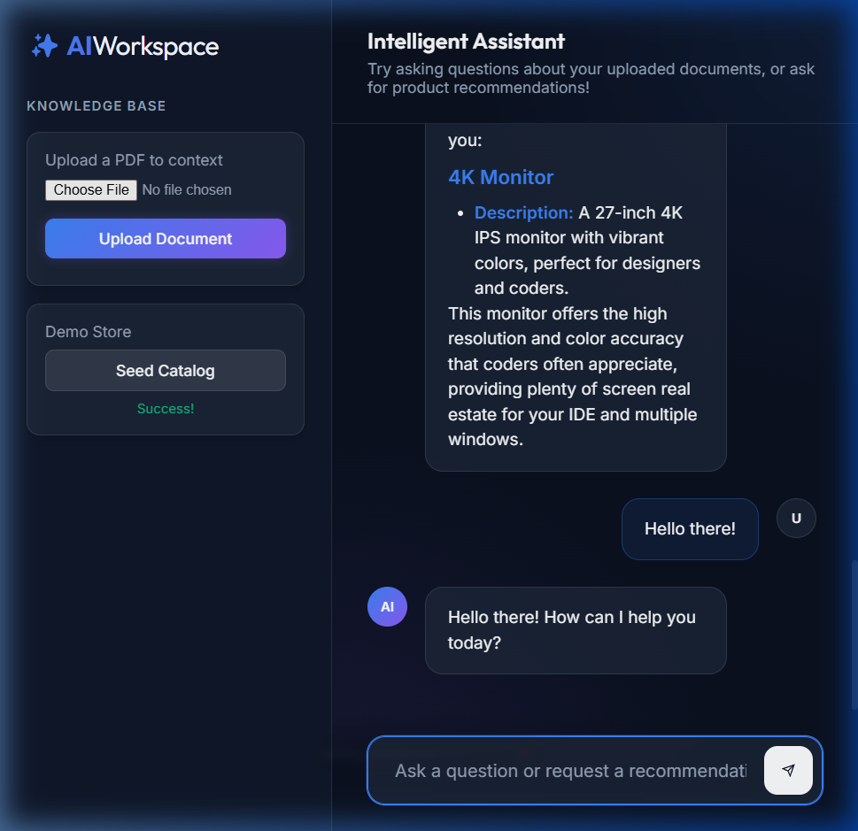
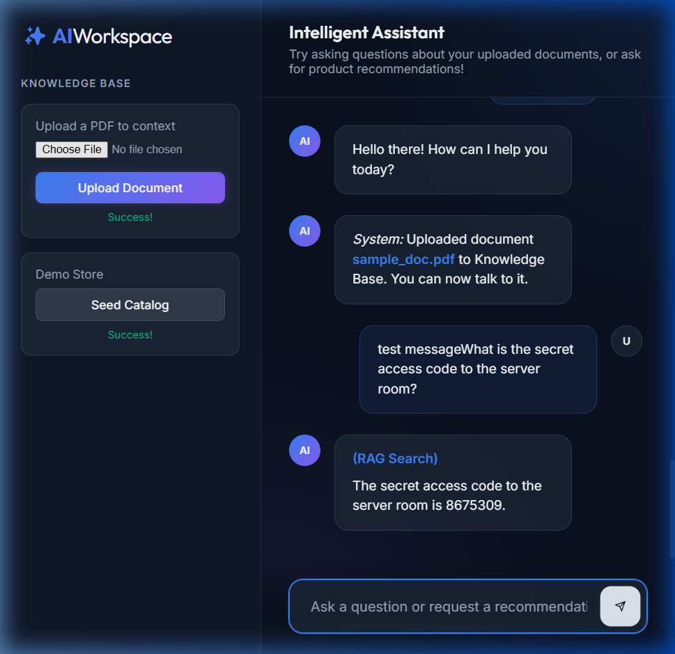

# 🤖 AI Workspace (RAG & Recommendations)

An AI-powered document assistant and dynamic e-commerce recommendation engine.
This project demonstrates advanced **Retrieval-Augmented Generation (RAG)**, **Semantic Search**, and **Agentic Routing Workflows** paired with a beautiful glassmorphism User Interface.

*Note: This project initially targeted the Endee vector database, but was adapted to use ChromaDB to support native execution on Windows without Docker environments while maintaining identical semantic search capabilities.*

---

## 🚀 Features

- 📄 **Upload PDF Documents**: Ingest documents on the fly into the vector knowledge base.
- 🔍 **Semantic Search**: Powered by `sentence-transformers`.
- 🧠 **Agentic AI Workflow**: A smart Gemini-powered agent that dynamically routes user intents to either RAG retrieval, Recommendation generation, or general conversation.
- 🛒 **Recommendation Engine**: Provides contextual item recommendations based on vector similarity.
- ⚡ **FastAPI Backend**: High performance API serving both the LLM logic and the static asset UI.
- 💬 **Interactive Premium UI**: A beautiful Vanilla HTML/CSS/JS frontend featuring dark-mode, glassmorphism, and markdown support.

---

## 🛠 Tech Stack

- **Python** (Backend Core)
- **FastAPI** & **Uvicorn** (Web framework and application server)
- **Google GenAI** (Gemini 2.5 Flash for LLM reasoning and routing)
- **ChromaDB** (Persistent native vector database)
- **Sentence Transformers** (`all-MiniLM-L6-v2` for embeddings)
- **PyPDF2** (Document parsing)
- **HTML5, CSS3, JS** (Frontend Interface)

---

## 🏗 System Architecture

```text
User Input (Chat / File Upload)
       │
      UI Frontend (Vanilla JS + CSS)
       │
   FastAPI Backend
       ├──> PDF -> PyPDF2 -> SentenceTransformer -> ChromaDB (Knowledge Base)
       │
   Agentic Router (Gemini)
       ├───> Intent: RAG       -> Query ChromaDB (Knowledge DB) -> Gemini -> User
       ├───> Intent: RECOMMEND -> Query ChromaDB (Products DB)  -> Gemini -> User
       └───> Intent: CHAT      -> Gemini -> User
```

---

## 📸 Project Screenshots & Demo

### AI Workspace Complete UI


### RAG & Recommendations In-Action


### RAG Document Upload feature


---

## 📂 Project Structure

```text
endee-rag-ai-project
│
├── api/
│   ├── main.py         # FastAPI application and endpoint routing
│   ├── agent.py        # Gemini Agentic routing and response generation
│   └── db_client.py    # ChromaDB integration and embedding logic
│
├── ui/
│   ├── index.html      # Main application interface
│   ├── style.css       # Premium Glassmorphism styling
│   └── app.js          # Client-side API interactions and chat logic
│
├── chroma_data/        # Persistent vector database storage
├── requirements.txt    # Python dependencies
└── README.md           # Project documentation
```

---

## ⚙ Installation

### 1. Clone the repository
```bash
git clone https://github.com/ajaykumarhn/endee.git
cd endee/endee-rag-ai-project
```

### 2. Install dependencies
Ensure you have Python 3.9+ installed.
```bash
pip install fastapi uvicorn sentence-transformers chromadb google-genai pypdf python-multipart
```

### 3. Configure API Keys
You need a Google Gemini API key to run the generative AI routing. Get one from [Google AI Studio](https://aistudio.google.com/).

Set the environment variable in your terminal:

**Windows (PowerShell):**
```powershell
$env:GEMINI_API_KEY="your_api_key_here"
```

**Linux/macOS:**
```bash
export GEMINI_API_KEY="your_api_key_here"
```

---

## ▶ Running the Project

Start the unified API server and UI:

```bash
python -m uvicorn api.main:app --host 0.0.0.0 --port 8000
```

Open your browser and navigate to:
**http://localhost:8000**

---

## 💡 Usage Guide

Once the application is running in your browser:

1. **Test the Recommendation Engine**:
   - Click the **"Seed Catalog"** button in the sidebar to populate the database with sample products.
   - Ask the AI: *"I need a new monitor for coding."* The agent will query the database and generate a curated response.
   
2. **Test RAG (Document Q&A)**:
   - Use the **"Upload a PDF to context"** section to upload a PDF file. (You can download and use the provided [sample_doc.pdf](sample_doc.pdf) for testing).
   - Wait for the "Success" confirmation.
   - Ask the AI a question about the contents of the document you uploaded, for example: *"What is the secret access code to the server room?"*

3. **General Chat**:
   - Ask the AI any general question like *"What is retrieval augmented generation?"* or *"Hello there!"*

---

## 👨‍💻 Author

Ajay Kumar  
GitHub: [https://github.com/ajaykumarhn](https://github.com/ajaykumarhn)
